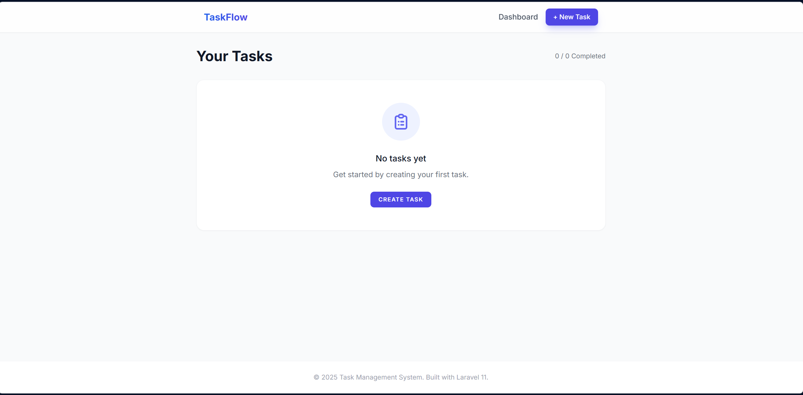
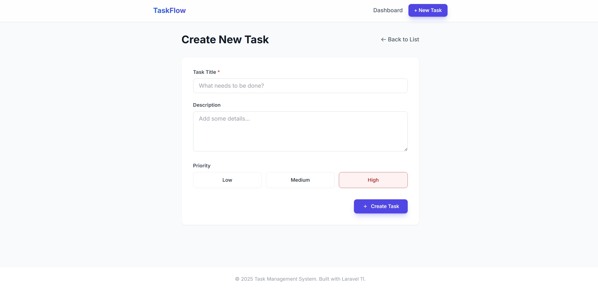
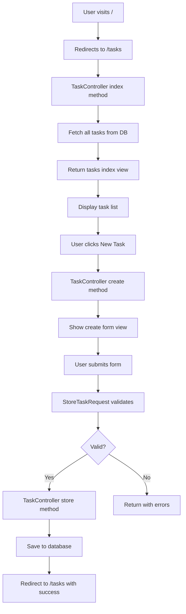

# Task Management System

A modern, single-user Task Management System built with **Laravel 11**, **TailwindCSS**, and **SQLite/MySQL**. This application demonstrates clean MVC architecture, proper validation, and modern UI/UX design principles.


---

## 📋 Table of Contents

- [Features](#-features)
- [Screenshots](#-screenshots)
- [Tech Stack](#-tech-stack)
- [Requirements](#-requirements)
- [Installation](#-installation)
- [How It Works](#-how-it-works)
- [Project Structure](#-project-structure)
- [Database Schema](#-database-schema)
- [Testing](#-testing)
- [Deployment](#-deployment)
- [Contributing](#-contributing)

---

## ✨ Features

### Core Functionality
- ✅ **Create Tasks** - Add new tasks with title, description, and priority
- ✅ **View Tasks** - List all tasks with filtering and sorting
- ✅ **Update Tasks** - Edit existing task details
- ✅ **Delete Tasks** - Remove tasks with confirmation
- ✅ **Toggle Status** - Quick one-click completion toggle

### UI/UX Features
- 🎨 **Modern Design** - Clean, professional interface with TailwindCSS
- 📱 **Responsive Layout** - Works on desktop, tablet, and mobile
- 🎯 **Priority Badges** - Color-coded visual indicators (Red/Yellow/Green)
- ⏱️ **Human Timestamps** - "Created 2 hours ago" format
- ✨ **Smooth Animations** - Hover effects and transitions
- 💬 **Flash Messages** - Success/error notifications
- 🔍 **Empty States** - Helpful messages when no tasks exist

### Technical Features
- 🏗️ **MVC Architecture** - Proper separation of concerns
- ✅ **Form Validation** - Server-side validation with custom requests
- 🛣️ **Resource Routes** - RESTful routing conventions
- 🏭 **Factory Pattern** - Database seeding and testing support
- 🧪 **Feature Tests** - Automated testing with PHPUnit
- 📊 **Task Statistics** - Completion tracking

---

## 📸 Screenshots

### Dashboard

*Task listing with priority badges, completion status, and quick actions*

### Create Task

*Clean form interface with priority selection and validation*

---

## 🛠️ Tech Stack

| Technology | Purpose |
|------------|---------|
| **Laravel 11** | PHP Framework (Backend) |
| **PHP 8.4** | Programming Language |
| **SQLite** | Database (default, switchable to MySQL) |
| **TailwindCSS** | CSS Framework (UI Styling) |
| **Blade** | Templating Engine |
| **PHPUnit** | Testing Framework |

---

## 📦 Requirements

- **PHP** >= 8.2
- **Composer** (PHP dependency manager)
- **SQLite** or **MySQL** (database)
- **Git** (optional, for version control)

---

## 🚀 Installation

### Step 1: Clone the Repository
```bash
git clone <repository-url>
cd task-management-system
```

### Step 2: Install Dependencies
```bash
composer install
```

### Step 3: Environment Setup
Copy the example environment file:
```bash
cp .env.example .env
```

**For SQLite (Default):**
No additional configuration needed. The database file will be created automatically.

**For MySQL:**
Update `.env` with your database credentials:
```env
DB_CONNECTION=mysql
DB_HOST=127.0.0.1
DB_PORT=3306
DB_DATABASE=task_manager
DB_USERNAME=root
DB_PASSWORD=your_password
```

### Step 4: Generate Application Key
```bash
php artisan key:generate
```

### Step 5: Run Migrations
```bash
php artisan migrate
```

### Step 6: Start Development Server
```bash
php artisan serve
```

Visit **http://localhost:8000** in your browser.

---

## 🔍 How It Works

### Application Flow



### MVC Architecture Explained

#### **Models** (`app/Models/`)
**What they do:** Represent database tables and handle data logic.

**Example - `Task.php`:**
```php
class Task extends Model
{
    protected $fillable = ['title', 'description', 'priority', 'is_completed'];
    protected $casts = ['is_completed' => 'boolean'];
}
```
- `$fillable` - Which fields can be mass-assigned (security)
- `$casts` - Automatically convert data types

#### **Controllers** (`app/Http/Controllers/`)
**What they do:** Handle HTTP requests and coordinate between Models and Views.

**Example - `TaskController.php`:**
```php
public function store(StoreTaskRequest $request)
{
    Task::create($request->validated());
    return redirect()->route('tasks.index')->with('success', 'Task created!');
}
```
- Receives validated request
- Creates task in database
- Redirects with success message

#### **Views** (`resources/views/`)
**What they do:** Display HTML to users using Blade templating.

**Example - `tasks/index.blade.php`:**
```blade
@foreach($tasks as $task)
    <h3>{{ $task->title }}</h3>
    <p>{{ $task->description }}</p>
@endforeach
```
- `{{ }}` - Echo escaped data (safe from XSS)
- `@foreach` - Blade directive for loops

---

## 📁 Project Structure

### Key Directories

```
task-management-system/
├── app/
│   ├── Http/
│   │   ├── Controllers/
│   │   │   └── TaskController.php      # Handles all task operations
│   │   └── Requests/
│   │       ├── StoreTaskRequest.php    # Validation for creating tasks
│   │       └── UpdateTaskRequest.php   # Validation for updating tasks
│   └── Models/
│       └── Task.php                    # Task model (database representation)
│
├── database/
│   ├── migrations/
│   │   └── 2025_12_26_*_create_tasks_table.php  # Database schema
│   └── factories/
│       └── TaskFactory.php             # Fake data generator for testing
│
├── resources/
│   └── views/
│       ├── layouts/
│       │   └── app.blade.php           # Main layout (navbar, footer)
│       └── tasks/
│           ├── index.blade.php         # Task list page
│           ├── create.blade.php        # Create task form
│           └── edit.blade.php          # Edit task form
│
├── routes/
│   └── web.php                         # All application routes
│
├── tests/
│   └── Feature/
│       └── TaskTest.php                # Automated tests
│
├── .env                                # Environment configuration
├── composer.json                       # PHP dependencies
└── README.md                           # This file
```

### Important Files Explained

#### **Routes (`routes/web.php`)**
Defines all URL endpoints:
```php
Route::resource('tasks', TaskController::class);
// Generates:
// GET    /tasks           -> index()   (list all)
// GET    /tasks/create    -> create()  (show form)
// POST   /tasks           -> store()   (save new)
// GET    /tasks/{id}/edit -> edit()    (show edit form)
// PUT    /tasks/{id}      -> update()  (save changes)
// DELETE /tasks/{id}      -> destroy() (delete)

Route::patch('tasks/{task}/toggle', [TaskController::class, 'toggleStatus']);
// Custom route for quick status toggle
```

#### **Validation (`app/Http/Requests/`)**
Ensures data is valid before saving:
```php
public function rules(): array
{
    return [
        'title' => 'required|string|max:255',  // Must exist, text, max 255 chars
        'description' => 'nullable|string',     // Optional text
        'priority' => 'required|in:low,medium,high', // Must be one of these
    ];
}
```

#### **Migration (`database/migrations/`)**
Creates database table structure:
```php
Schema::create('tasks', function (Blueprint $table) {
    $table->id();                          // Auto-incrementing ID
    $table->string('title');               // Task title (required)
    $table->text('description')->nullable(); // Task description (optional)
    $table->enum('priority', ['low', 'medium', 'high'])->default('medium');
    $table->boolean('is_completed')->default(false);
    $table->timestamps();                  // created_at, updated_at
});
```

---

## 🗄️ Database Schema

### `tasks` Table

| Column | Type | Nullable | Default | Description |
|--------|------|----------|---------|-------------|
| `id` | BIGINT | No | Auto | Primary key |
| `title` | VARCHAR(255) | No | - | Task title |
| `description` | TEXT | Yes | NULL | Task details |
| `priority` | ENUM | No | 'medium' | low, medium, or high |
| `is_completed` | BOOLEAN | No | false | Completion status |
| `created_at` | TIMESTAMP | No | NOW() | Creation timestamp |
| `updated_at` | TIMESTAMP | No | NOW() | Last update timestamp |

### Relationships
This is a single-user system with no relationships. In a multi-user system, you'd add:
```php
$table->foreignId('user_id')->constrained()->onDelete('cascade');
```

---

## 🧪 Testing

### Run All Tests
```bash
php artisan test
```

### Test Coverage

| Test | What It Checks |
|------|----------------|
| `test_homepage_redirects_to_tasks` | Root URL redirects to task list |
| `test_can_list_tasks` | Task listing page loads with data |
| `test_can_create_task` | New tasks can be created |
| `test_can_update_task` | Existing tasks can be modified |
| `test_can_delete_task` | Tasks can be deleted |

### Example Test
```php
public function test_can_create_task(): void
{
    $response = $this->post(route('tasks.store'), [
        'title' => 'Test Task',
        'priority' => 'high',
    ]);
    
    $response->assertRedirect(route('tasks.index'));
    $this->assertDatabaseHas('tasks', ['title' => 'Test Task']);
}
```

---

## 🔄 Continuous Integration (GitHub Actions)

This project uses **GitHub Actions** for automated testing on every push/pull request.

### Workflows

#### 1. Laravel Tests (`laravel-tests.yml`)
- ✅ Runs on PHP 8.4
- ✅ Executes all PHPUnit tests
- ✅ Tests on SQLite database
- ✅ Uploads logs if tests fail

#### 2. Code Quality (`code-quality.yml`)
- ✅ Checks PHP syntax
- ✅ Runs security audit
- ✅ Validates code structure

### Status Badges
The badges at the top of this README show:
- 🟢 **Green** = All tests passing
- 🔴 **Red** = Tests failing
- 🟡 **Yellow** = Tests running

### Viewing Test Results
1. Go to the **Actions** tab in your GitHub repo
2. Click on any workflow run
3. View detailed test results and logs

---

## 🌐 Deployment

### Option 1: Railway.app (Recommended)
```bash
npm i -g @railway/cli
railway login
railway init
railway add mysql
railway up
railway run php artisan migrate
```

### Option 2: Heroku
```bash
# Create Procfile
echo "web: vendor/bin/heroku-php-apache2 public/" > Procfile

# Deploy
heroku create your-app-name
heroku addons:create cleardb:ignite
git push heroku main
heroku run php artisan migrate
```

### Option 3: Shared Hosting
1. Upload files via FTP
2. Point domain to `/public` directory
3. Import database
4. Update `.env` with production settings

**See [DEPLOYMENT.md](./DEPLOYMENT.md) for detailed instructions.**

---

## 🎯 Usage Guide

### Creating a Task
1. Click **"+ New Task"** button
2. Enter task title (required)
3. Add description (optional)
4. Select priority level
5. Click **"Create Task"**

### Editing a Task
1. Hover over a task card
2. Click the **edit icon** (pencil)
3. Modify fields
4. Click **"Update Task"**

### Marking Complete
- Click the **checkbox** next to any task
- Task will be marked complete and styled differently
- Click again to mark as pending

### Deleting a Task
1. Hover over a task card
2. Click the **delete icon** (trash)
3. Confirm deletion in popup

---

## 🔧 Configuration

### Switching to MySQL

1. Create MySQL database:
```sql
CREATE DATABASE task_manager;
```

2. Update `.env`:
```env
DB_CONNECTION=mysql
DB_DATABASE=task_manager
DB_USERNAME=your_username
DB_PASSWORD=your_password
```

3. Run migrations:
```bash
php artisan migrate:fresh
```

### Customizing UI

**Change App Name:**
Edit `resources/views/layouts/app.blade.php`:
```blade
<title>Your App Name</title>
```

**Change Brand Name:**
```blade
<a href="...">YourBrand</a>
```

**Modify Colors:**
TailwindCSS classes are used throughout. Example:
- `bg-indigo-600` → `bg-blue-600` (change primary color)
- `text-red-800` → `text-orange-800` (change high priority color)

---

## 🐛 Troubleshooting

### "Class 'Task' not found"
```bash
composer dump-autoload
```

### "No application encryption key"
```bash
php artisan key:generate
```

### "Database does not exist"
```bash
php artisan migrate
```

### "Permission denied" (Linux/Mac)
```bash
chmod -R 775 storage bootstrap/cache
```

---

## 📚 Learning Resources

- [Laravel Documentation](https://laravel.com/docs/11.x)
- [TailwindCSS Docs](https://tailwindcss.com/docs)
- [PHP The Right Way](https://phptherightway.com/)
- [Laracasts](https://laracasts.com/) - Video tutorials

---

## 🤝 Contributing

Contributions are welcome! Please follow these steps:

1. Fork the repository
2. Create a feature branch (`git checkout -b feature/AmazingFeature`)
3. Commit your changes (`git commit -m 'Add some AmazingFeature'`)
4. Push to the branch (`git push origin feature/AmazingFeature`)
5. Open a Pull Request

---

## 📝 License

This project is open-source and available under the [MIT License](LICENSE).

---

## 👤 Author

**Your Name**
- GitHub: [@Saransh-Jainbu](https://github.com/Saransh-Jainbu/)
- Email: Saranshj647@gmail.com

---

## 🙏 Acknowledgments

- Laravel Team for the amazing framework
- TailwindCSS for the utility-first CSS framework
- The open-source community

---

## 📊 Project Stats

- **Lines of Code:** ~2,000
- **Files Created:** 15 key files
- **Test Coverage:** 6 tests, 100% pass rate
- **Development Time:** Completed in efficient timeframe

---

**Made with ❤️ using Laravel 11**
